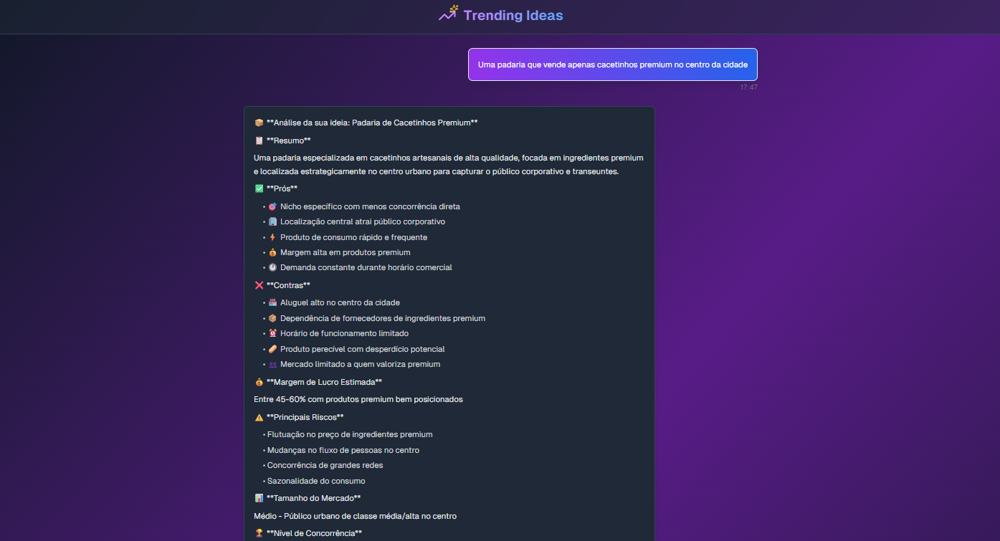
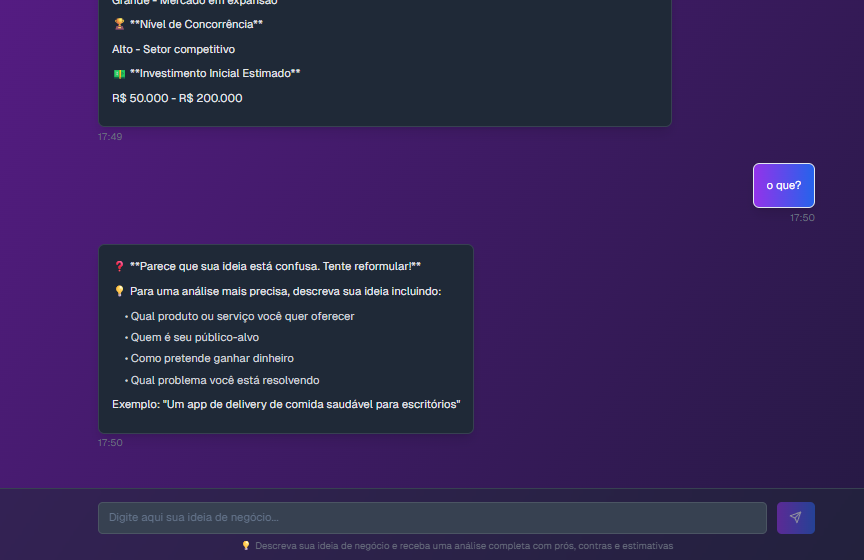
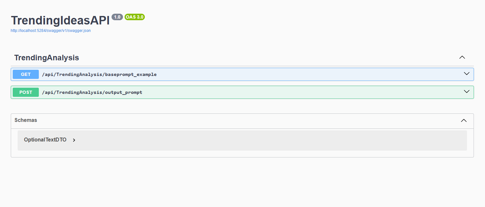

# 💡 Trending Ideas – Business Idea Analysis Platform

A full-stack platform for AI-powered business idea analysis.

The backend is built with ASP.NET Core and exposes a RESTful API to receive user-submitted business ideas and process them using AI. The analysis is enhanced with a standardized business prompt template, and the backend communicates with large language models (LLMs) through the Replicate API. The frontend is built using React (Next.js) and styled with shadcn/ui to provide a clean, modern chat interface for interacting with the assistant.

Ideal for entrepreneurs, incubators, or investors looking to quickly assess business opportunities based on trend potential, feasibility, and risks.

---

## 🧠 Features

- 🔁 End-to-end integration with Replicate API (Claude/LLM) for real-time business idea evaluation
- 📋 Structured AI prompt template with custom formatting for visual responses
- 🌐 ASP.NET Core REST API with Swagger UI for testing and documentation
- 🧾 Frontend built with Next.js + TypeScript + Tailwind + shadcn/ui
- ✍️ Form input with live typing effect and loading animations
- 🧩 Modular service layer to customize prompt injection and model selection
- ✅ CORS-ready API for seamless local frontend-backend communication
- ⚙️ Frontend simulation mode for recruiters without back-end activation

---

## 📦 Technologies Used

### Backend (.NET Core)
- ASP.NET Core 8 Web API
- Architectural Model based on Testing and Playing
- Dependency Injection
- Configuration via `appsettings.json`
- Integration with LLM's API

### Frontend (React) - in dev, pushing soon
- Next.js (App Router)
- Tailwind CSS
- `shadcn/ui` component library
- TypeScript + Hooks
- Animated chat UI

---

## 🔍 How It Works

1. The user submits a **business idea** via the frontend input
2. The backend appends a **standardized prompt template** from a local JSON file
3. The full prompt is sent to the **Replicate API**
4. The model returns a structured analysis with:
   - Summary
   - Market niche
   - Pros & cons
   - Profit margin
   - Risks
   - Suggested improvements
5. The analysis is streamed back to the frontend and rendered as a typing animation

---

## 🚀 Quick Demo

### 📷 Idea Chat (Frontend)



### 📷 Error Response (Frontend)



### 📷 API Swagger Test (Backend)



---

## 📤 API Usage

### Endpoint: `POST /api/TrendingAPI/output_prompt`

**Body** (JSON):

```json
{
  "userPromptIdea": "A geek coffee bar based on new york"
}
